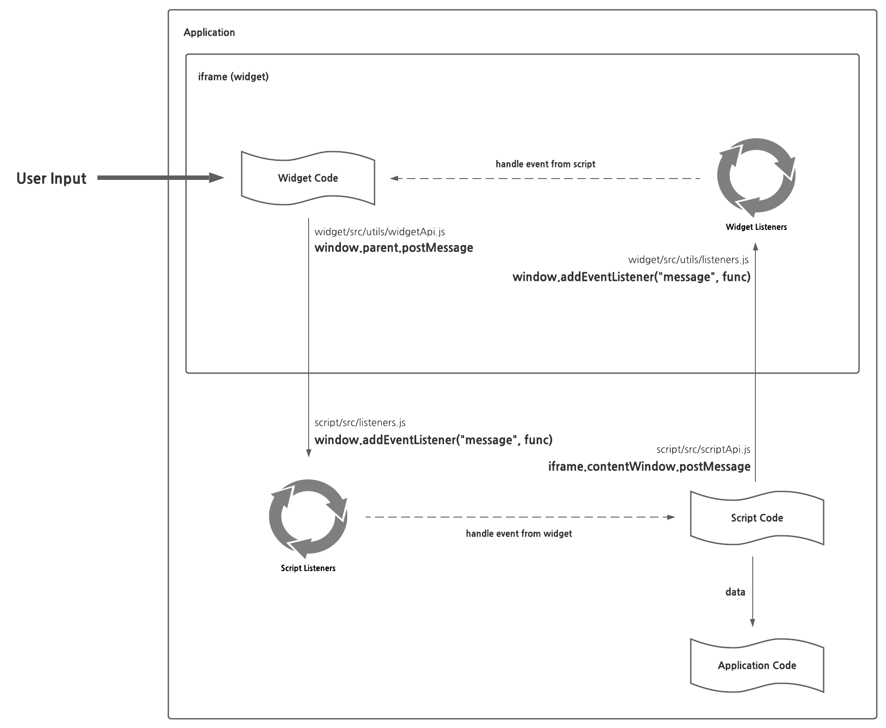

# Widget Example

This repository serves as an example of how a (web-based) widget should be structured.

## Usage

To use this widget example, you first need to compile the script:

```sh
yarn --cwd script build
```

This will bundle the code inside `scripts` into two formats: `iife` (to import directly onto the HTML) and `es` (to use with `npm`). Then, you need to start the widget:

```sh
yarn --cwd widget dev
```

This will start the server at `http://localhost:3000`. Keep in mind that this will block your terminal.

Now, you can open the file `examples/index.html` with your favorite browser, and the widget will appear!

## Design

The design choices that were made for this widget can be separated into two categories.

### Structure

The main idea is that the `widget` folder contains a web application that should be deployed to a public URL (probably as a bunch of static assets). Then, the client imports the scripts inside of the `scripts` folder, which should be deployed to `npm` and/or some CDN. The contents of `scripts` correspond to a bunch of code that inserts an `iframe` to the DOM with the contents of the `widget` application. The `scripts` also handle the communication with the widget.

### Communication

The communication between the script and the widget is through the DOM, using listeners and the `postMessage` method. Using this mechanism, the widget is able to interact with the script seamlessly. The following image corresponds to the general communication schema:


